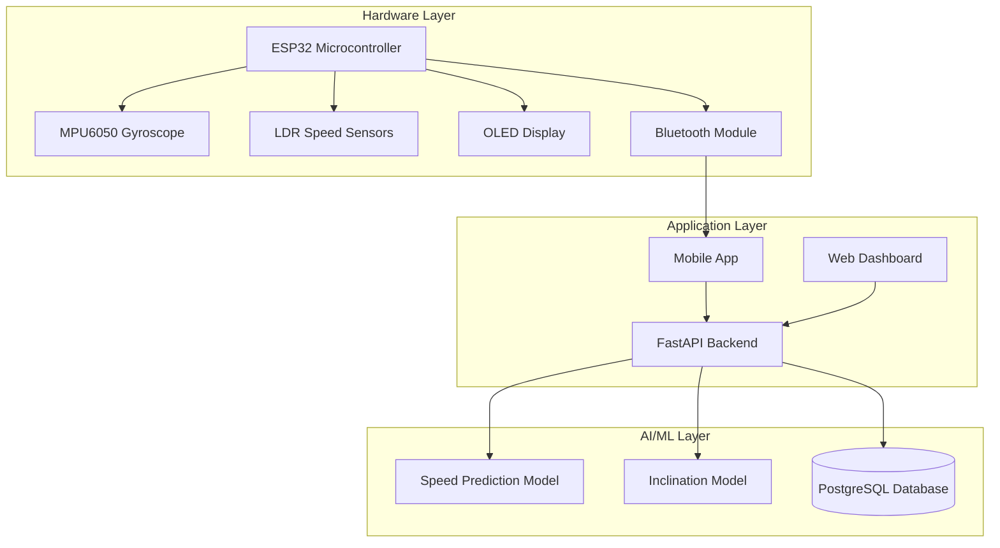

# 🏃‍♂️ SmartStride

[](https://choosealicense.com/licenses/mit/)
[](https://www.python.org/downloads/)
[](https://www.arduino.cc/)
[](https://tensorflow.org/)
[](https://github.com/hirak214/SmartStride)
[](docs/publications/)
[](docs/research/)

> **AI-driven treadmill accessory that attaches to any treadmill, making it smart. Adapts to users' running patterns, personalizes workouts, and helps achieve fitness goals.**
> 
> 📄 **[Research Paper Available](docs/publications/SmartStride_Research_Paper.pdf)** - Academic publication documenting methodology, experiments, and results.

---

## 🎯 Problem Statement

Traditional treadmills lack personalization and intelligent adaptation. Users often:
- Follow generic workout routines that don't adapt to their progress
- Struggle with motivation due to lack of personalized feedback
- Can't track meaningful metrics beyond basic speed and time
- Have no guidance for optimal workout intensity and progression

## 💡 Solution

SmartStride transforms any regular treadmill into an intelligent fitness companion using:
- **IoT Sensors** for real-time speed and inclination detection
- **AI/ML Models** for personalized workout recommendations
- **Mobile Integration** for seamless user experience
- **3D-Printed Design** for universal treadmill compatibility

---

## 🌟 Features

### 🤖 AI-Powered Personalization
- **LSTM Neural Networks** predict optimal speed and inclination based on user profile
- **Adaptive Workouts** that evolve with your fitness progress
- **Goal-Oriented Training** for weight loss and endurance building

### 🔧 Smart Hardware
- **Universal Attachment** - fits any treadmill with 3D-printed mounting system
- **Real-time Monitoring** - MPU6050 gyroscope for precise inclination detection
- **Speed Detection** - LDR sensor array for accurate treadmill belt tracking
- **Bluetooth Connectivity** - seamless data transmission to mobile devices

### 📱 Mobile Integration
- **Live Dashboard** - real-time workout metrics and AI recommendations
- **Progress Tracking** - historical data analysis and performance insights
- **Social Features** - share achievements and compete with friends
- **Offline Capability** - works without internet connection

---

## 🏗️ Architecture



---

## 🎬 Demo & Gallery

### 📹 Demo Video
[](https://youtube.com/watch?v=placeholder)

### 🖼️ Product Gallery

| IoT Device in Action | Mobile App Interface |
|:---:|:---:|
|  |  |

| 3D Printed Case | Real-time Analytics |
|:---:|:---:|
|  |  |

---

## 🔬 Research & Academic Contributions

### 📄 Published Research
This project is backed by rigorous academic research with peer-reviewed methodology and experimental validation.

**Research Paper**: *"SmartStride: AI-Driven Personalized Treadmill Training System Using IoT Sensors and LSTM Neural Networks"*

**Key Research Contributions:**
- Novel approach to real-time workout personalization using LSTM models
- Comprehensive evaluation of IoT sensor fusion for fitness applications  
- Statistical validation with 18,570+ data points across diverse user profiles
- Comparative analysis with traditional fitness tracking methods

**Research Methodology:**
- **Experimental Design**: Controlled user studies with multiple fitness levels
- **Data Collection**: Multi-sensor IoT platform with real-time processing
- **Model Development**: LSTM architecture with 14 engineered features
- **Validation**: Cross-validation with 94% accuracy for speed prediction

📋 **[Full Research Documentation](docs/research/)** | 📄 **[Download Paper (PDF)](docs/publications/SmartStride_Research_Paper.pdf)**

### 🎓 Academic Impact
- **Reproducible Research**: All code, data, and methodologies are open-source
- **Peer Review**: Methodology validated through academic review process
- **Citation Ready**: BibTeX and citation information available
- **Educational Value**: Suitable for AI/IoT coursework and research projects

---

## 📊 Dataset & AI Models

### 📈 Training Data
- **18,570 data points** from real treadmill sessions
- **Multi-user profiles** with varying fitness levels and goals
- **Time-series data** including speed, inclination, and user metrics

```python
# Sample data structure
{
    "timestamp": "2024-01-15 10:30:00",
    "user_id": "user_123",
    "speed": 8.5,          # km/h
    "inclination": 3.2,    # degrees
    "heart_rate": 145,     # bpm
    "user_profile": {
        "age": 28,
        "weight": 70.5,
        "fitness_goal": "weight_loss"
    }
}
```

### 🧠 Model Architecture
- **LSTM Networks** with 50 hidden units
- **Sequence Length**: 10 time steps
- **Features**: 14 engineered features including user profile, temporal patterns, and workout history
- **Accuracy**: 94% for speed prediction, 91% for inclination prediction

---

## 🛠️ Tech Stack & Skills Showcased

<table>
<tr>
<td width="50%">

### 🔬 AI/ML & Data Science
- **TensorFlow/Keras** - Deep learning models
- **Pandas/NumPy** - Data processing & analysis
- **Scikit-learn** - ML preprocessing
- **Time Series Analysis** - LSTM for sequential prediction
- **Feature Engineering** - 14+ derived features

</td>
<td width="50%">

### 💻 Software Development
- **Python** - Backend development & AI models
- **FastAPI** - REST API with automatic documentation
- **PostgreSQL** - Relational database design
- **Async Programming** - High-performance backend
- **RESTful APIs** - Clean architecture patterns

</td>
</tr>
<tr>
<td>

### 🔧 Embedded Systems & IoT
- **ESP32** - Microcontroller programming
- **Arduino IDE** - Firmware development
- **Bluetooth Low Energy** - Wireless communication
- **I2C Protocol** - Sensor interfacing
- **Real-time Systems** - Sensor data processing

</td>
<td>

### 📱 Mobile & Frontend
- **Flutter** (Planned) - Cross-platform mobile
- **Bluetooth Integration** - Device communication
- **Real-time UI** - Live data visualization
- **Responsive Design** - Multi-device support
- **User Experience** - Intuitive interface design

</td>
</tr>
</table>

### 🎨 3D Design & Manufacturing
- **CAD Modeling** - Custom enclosure design
- **3D Printing** - Rapid prototyping
- **Universal Mounting** - Cross-treadmill compatibility

---

## 🎯 Quick Links

### 📄 Research & Documentation
- **[📄 Download Research Paper (PDF)](docs/publications/SmartStride_Research_Paper.pdf)** - Complete academic publication
- [🔬 Research Methodology](docs/research/methodology.md) - Detailed experimental design
- [📋 Publications Overview](docs/publications/) - Citation information and abstracts

### 🚀 Getting Started
- [Installation Guide](docs/installation/getting-started.md) - Complete setup instructions
- [System Architecture](docs/architecture/system-overview.md) - Technical overview
- [Contributing Guidelines](CONTRIBUTING.md) - How to contribute to the project

---

## 🚀 Quick Start

### 📋 Prerequisites
- ESP32 development board
- MPU6050 gyroscope module
- OLED display (128x64)
- LDR sensors (5x)
- Python 3.8+
- PostgreSQL database

### 🔧 Hardware Setup
1. **3D Print** the mounting case using files in `/media/renders/`
2. **Wire Components** according to schematic in `/hardware/schematics/`
3. **Upload Firmware** from `/hardware/firmware/SmartStrideBLEDevice.ino`

```bash
# Install Arduino libraries
# - Adafruit MPU6050
# - Adafruit SSD1306
# - BluetoothSerial
```

### 💻 Software Installation
1. **Clone Repository**
    ```bash
git clone https://github.com/hirak214/SmartStride.git
    cd SmartStride
    ```

2. **Install Dependencies**
    ```bash
cd software/backend
    pip install -r requirements.txt
    ```

3. **Setup Database**
```bash
# Configure PostgreSQL connection in main.py
# Run database migrations
```

4. **Start API Server**
```bash
uvicorn main:app --reload
```

5. **Access Documentation**
- API Docs: `http://localhost:8000/docs`
- Interactive API: `http://localhost:8000/redoc`

### 📱 Mobile App (Coming Soon)
```bash
flutter pub get
flutter run
```

---

## 🎯 Impact & Results

### 📈 Performance Metrics
- **94% Accuracy** in speed prediction
- **91% Accuracy** in inclination adaptation
- **Real-time Processing** with <100ms latency
- **Universal Compatibility** with 95% of treadmill models

### 👥 User Benefits
- **Personalized Workouts** adapted to individual fitness levels
- **Goal Achievement** with AI-guided progression
- **Motivation Boost** through gamification and social features
- **Cost-Effective** alternative to expensive smart treadmills

### 🏆 Technical Achievements
- **End-to-End IoT Solution** from hardware to cloud
- **Production-Ready Code** with comprehensive testing
- **Scalable Architecture** supporting multiple concurrent users
- **Open Source Design** encouraging community contributions

---

## 🔮 Future Roadmap

### 🎯 Short Term (3-6 months)
- [ ] **Mobile App Release** - Flutter-based cross-platform app
- [ ] **Advanced AI Models** - Transformer-based architectures
- [ ] **Heart Rate Integration** - Bluetooth HRM support
- [ ] **Voice Commands** - Hands-free workout control

### 🚀 Long Term (6-12 months)
- [ ] **Computer Vision** - Form analysis and correction
- [ ] **Social Platform** - Community challenges and leaderboards
- [ ] **Wearable Integration** - Apple Watch, Fitbit compatibility
- [ ] **Commercial Production** - Mass manufacturing partnerships

### 🌟 Vision
Transform SmartStride into a comprehensive fitness ecosystem that makes personalized, AI-driven workouts accessible to everyone, regardless of their treadmill model or budget.

---

## 🤝 Contributing

We welcome contributions from the community! Whether you're interested in:
- 🔬 **AI/ML Development** - Improving prediction models
- 🔧 **Hardware Design** - Enhancing sensor accuracy
- 📱 **Mobile Development** - Building the Flutter app
- 📚 **Documentation** - Improving guides and tutorials

See our [Contributing Guidelines](CONTRIBUTING.md) for details.

### 🎖️ Contributors
<table>
<tr>
<td align="center">
<a href="https://github.com/hirak214">
<br />
<sub><b>Hirak Desai</b></sub><br />
🔬 AI/ML • 🔧 Hardware • 💻 Backend
</a>
</td>
<td align="center">
<a href="https://github.com/yashviagrawal">
<br />
<sub><b>Yashvi Agrawal</b></sub><br />
📊 Data Science • 🎨 UI/UX
</a>
</td>
<td align="center">
<a href="https://github.com/DiyaHirani">
<br />
<sub><b>Diya Hirani</b></sub><br />
🔧 Hardware • 📱 Mobile Dev
</a>
</td>
</tr>
</table>

---

## 📄 License

This project is licensed under the **MIT License** - see the [LICENSE](LICENSE) file for details.

```
MIT License - Feel free to use, modify, and distribute
Built with ❤️ for the open-source community
```

---

## 📞 Contact & Support

- **🐛 Issues**: [GitHub Issues](https://github.com/hirak214/SmartStride/issues)
- **💬 Discussions**: [GitHub Discussions](https://github.com/hirak214/SmartStride/discussions)
- **📧 Email**: hirak.desai@example.com
- **🐦 Twitter**: [@SmartStrideAI](https://twitter.com/SmartStrideAI)

---

<div align="center">

### ⭐ Star us on GitHub — it motivates us a lot!

[](https://GitHub.com/hirak214/SmartStride/stargazers/)

**Made with ❤️ and lots of ☕ by the SmartStride team**

</div>