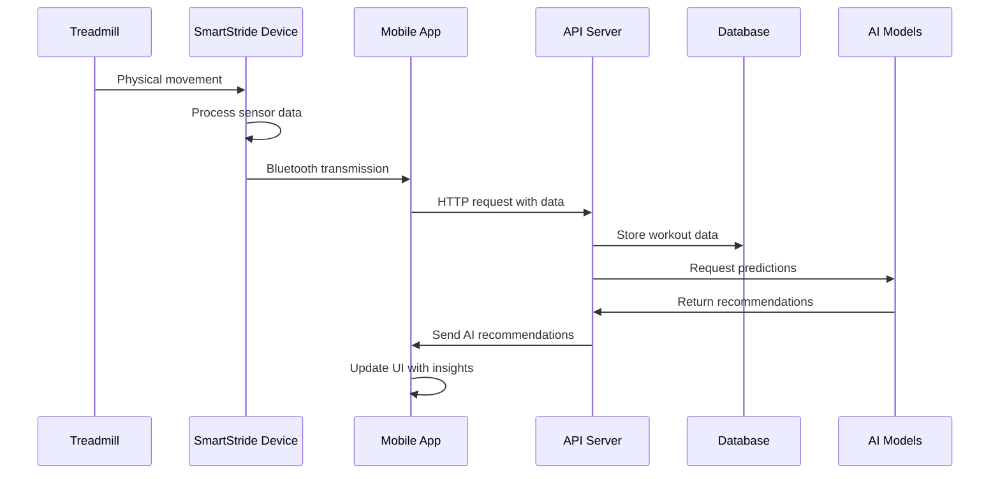

# 🏗️ System Architecture Overview

## High-Level Architecture

SmartStride follows a three-tier architecture with clear separation of concerns:

### 1. Hardware Layer (IoT Device)
```
┌─────────────────────────────────────────────────┐
│                ESP32 Core                       │
├─────────────────────────────────────────────────┤
│  MPU6050    │  LDR Array  │  OLED   │  Bluetooth │
│ (Gyroscope) │ (5 sensors) │Display  │    BLE     │
└─────────────────────────────────────────────────┘
```

**Components:**
- **ESP32**: Main microcontroller with dual-core processor
- **MPU6050**: 6-axis gyroscope/accelerometer for inclination detection
- **LDR Sensors**: 5 light-dependent resistors for speed measurement
- **OLED Display**: 128x64 pixel display for status information
- **Bluetooth**: Low-energy communication with mobile devices

### 2. Application Layer (Backend Services)
```
┌─────────────────────────────────────────────────┐
│                FastAPI Server                   │
├─────────────────────────────────────────────────┤
│  Authentication │  Data Processing │  AI Engine │
│      REST API   │   Real-time      │   LSTM     │
│                 │   Analytics      │  Models    │
└─────────────────────────────────────────────────┘
```

**Services:**
- **REST API**: FastAPI-based endpoints for data exchange
- **Authentication**: User management and session handling
- **Data Processing**: Real-time sensor data analysis
- **AI Engine**: LSTM models for workout personalization

### 3. Data Layer (Storage & Analytics)
```
┌─────────────────────────────────────────────────┐
│              PostgreSQL Database                │
├─────────────────────────────────────────────────┤
│  User Profiles │ Workout Data │ Model Training │
│      Goals     │   History    │     Data       │
└─────────────────────────────────────────────────┘
```

## Data Flow Architecture



## Component Interactions

### Real-time Data Processing
1. **Sensor Reading** (10Hz frequency)
   - MPU6050 provides gyroscope data for inclination
   - LDR sensors detect treadmill belt movement for speed
   - ESP32 processes and filters sensor data

2. **Data Transmission** (Bluetooth LE)
   - Formatted data packets sent every 500ms
   - Format: `speed,inclination,timestamp`
   - Error handling and reconnection logic

3. **Mobile Processing**
   - Real-time display of workout metrics
   - Local data buffering for offline capability
   - Background synchronization with backend

### AI Model Integration

#### Speed Prediction Model
```python
# LSTM Architecture
model = Sequential([
    LSTM(50, input_shape=(sequence_length, features)),
    Dense(1, activation='linear')
])

# Features used:
# - User profile (age, weight, fitness level)
# - Historical performance data
# - Time-based patterns (hour, day, week)
# - Workout context (duration, intensity)
```

#### Inclination Adaptation Model
```python
# Multi-input LSTM for inclination
model = Sequential([
    LSTM(50, return_sequences=True),
    LSTM(50),
    Dense(1, activation='sigmoid')  # 0-1 for inclination percentage
])
```

## Security Architecture

### Data Protection
- **Encryption**: All Bluetooth communication encrypted
- **Authentication**: JWT-based API authentication
- **Privacy**: User data anonymized for model training
- **Local Storage**: Sensitive data kept on device when possible

### Network Security
- **HTTPS**: All API communications over TLS
- **Rate Limiting**: API endpoints protected against abuse
- **Input Validation**: All user inputs sanitized
- **Database Security**: Parameterized queries prevent injection

## Scalability Considerations

### Horizontal Scaling
- **Stateless API**: Enables load balancing across multiple servers
- **Database Partitioning**: User data sharded by user ID
- **Caching Layer**: Redis for frequently accessed data
- **CDN**: Static assets served from edge locations

### Performance Optimization
- **Async Processing**: FastAPI with async/await patterns
- **Connection Pooling**: Efficient database connections
- **Model Caching**: Pre-loaded AI models for faster inference
- **Data Compression**: Optimized data formats for mobile transmission

## Monitoring & Observability

### Health Checks
- Device connectivity status
- API endpoint availability
- Database connection health
- Model inference performance

### Metrics Collection
- Workout session analytics
- User engagement patterns
- System performance metrics
- Error rates and debugging info

### Alerting
- Device disconnection alerts
- API performance degradation
- Database query timeouts
- Model accuracy drift detection
